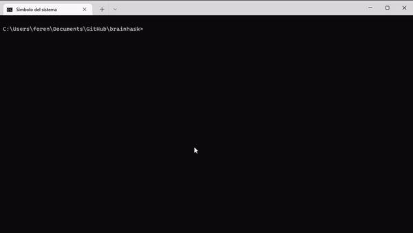

<h3 align="center"><b>Brainhask</b></h3>

  

    Turing complete language interpreter. Based in <a href="https://en.wikipedia.org/wiki/Brainfuck">Brainf**k.</a>
  

## About Brainhask

Brainhask is a tiny interpreter for the [Brainf**k](https://en.wikipedia.org/wiki/Brainfuck) language. It features an **inline/file input interpreter**, and a **REPL**.

As the original language, Brainhask has only eight commands based in the following characters:

<table class="wikitable">

<tbody><tr>
<th style="text-align:center;">Character
</th>
<th align="left">Meaning
</th></tr>
<tr>
<td style="text-align:center"><code>&gt;</code>
</td>
<td>Increment the <a href="/wiki/Pointer_(computer_programming)" title="Pointer (computer programming)">data pointer</a> (to point to the next cell to the right).
</td></tr>
<tr>
<td style="text-align:center"><code>&lt;</code>
</td>
<td>Decrement the data pointer (to point to the next cell to the left).
</td></tr>
<tr>
<td style="text-align:center"><code>+</code>
</td>
<td>Increment (increase by one) the byte at the data pointer.
</td></tr>
<tr>
<td style="text-align:center"><code>-</code>
</td>
<td>Decrement (decrease by one) the byte at the data pointer.
</td></tr>
<tr>
<td style="text-align:center"><code>.</code>
</td>
<td>Output the byte at the data pointer.
</td></tr>
<tr>
<td style="text-align:center"><code>,</code>
</td>
<td>Accept one byte of input, storing its value in the byte at the data pointer.
</td></tr>
<tr>
<td style="text-align:center"><code>[</code>
</td>
<td>If the byte at the data pointer is zero, then instead of moving the <a href="/wiki/Program_Counter" class="mw-redirect" title="Program Counter">instruction pointer</a> forward to the next command, <a href="/wiki/Branch_(computer_science)" title="Branch (computer science)">jump</a> it <i>forward</i> to the command after the <i>matching</i> <code>]</code> command.
</td></tr>
<tr>
<td style="text-align:center"><code>]</code>
</td>
<td>If the byte at the data pointer is nonzero, then instead of moving the instruction pointer forward to the next command, jump it <i>back</i> to the command after the <i>matching</i> <code>[</code> command.
</td></tr></tbody></table>

## Usage

[Download the binary](https://github.com/Forensor/brainhask/releases), open your terminal and move to the .exe path. The input file extension can be any plain text, but *.bhs* is used by convention.

Commands:

`bhs <filename>` - Executes the program passed by the input file.

`bhs -i <input>` - Executes the program passed by the input line.

`bhs help` - Prints the help message.

`bhs repl` - Starts the Brainhask repl. Use ':q' to quit.

## Contribute

Any bugfix, idea, or request can be resolved by [opening an issue](https://github.com/Forensor/brainhask/issues).

## License

MIT © Álvaro
